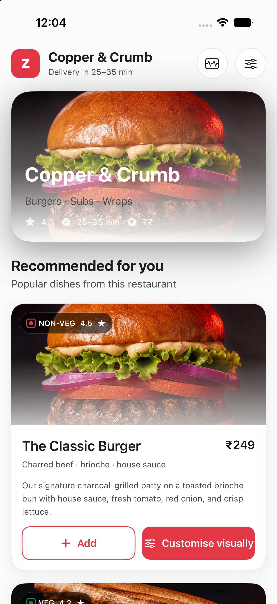
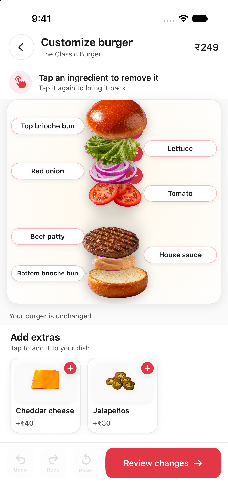
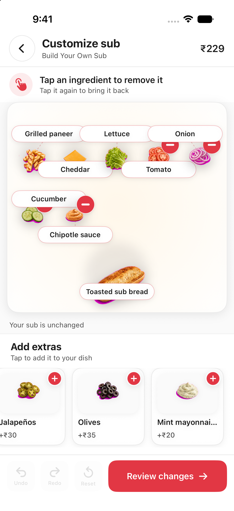
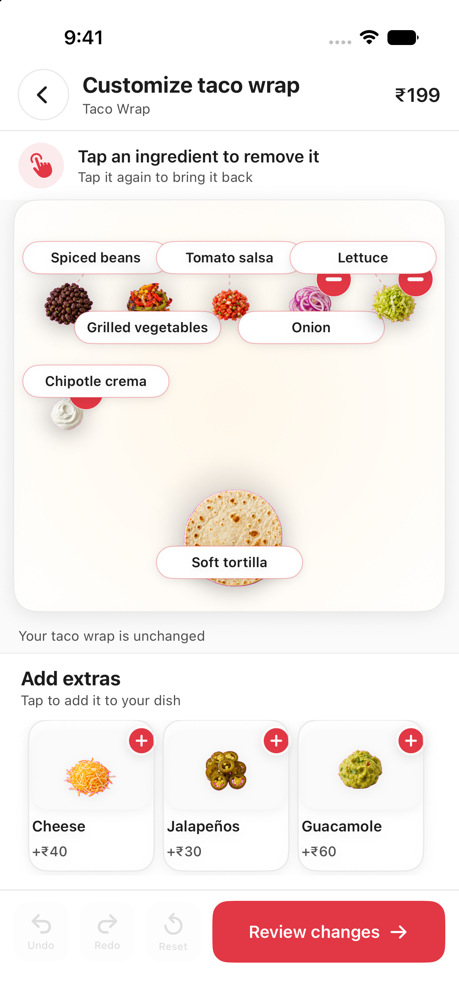
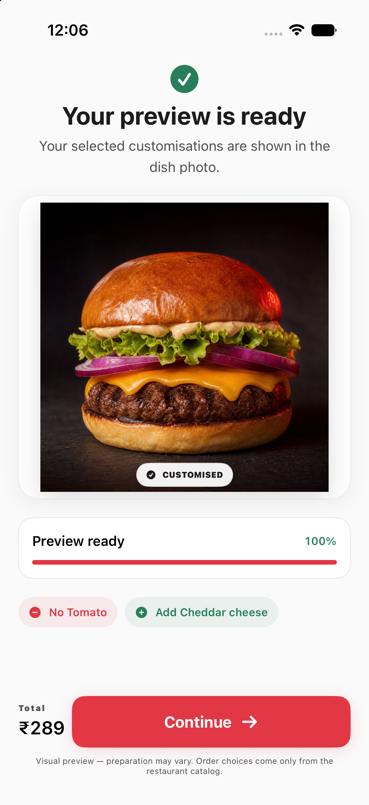
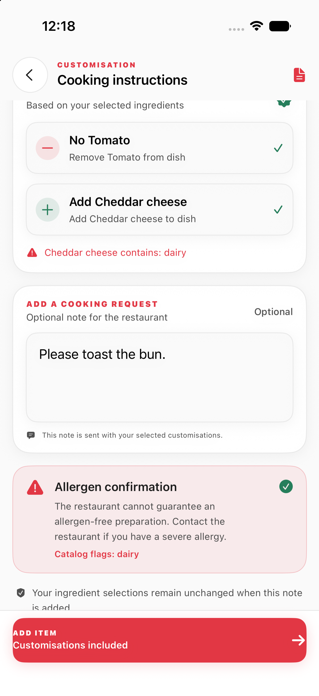
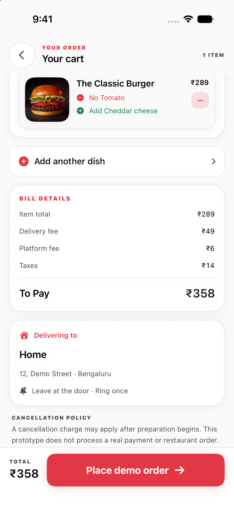
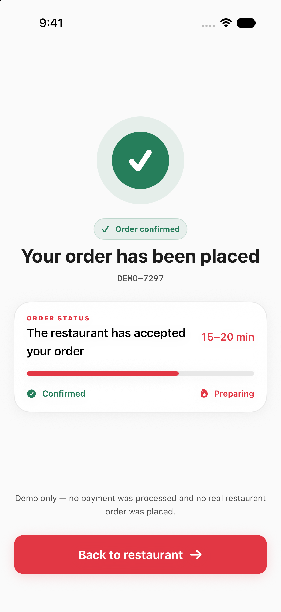

<div align="center">

# DishEdit

### Touch what you mean.

DishEdit turns food customisation into direct manipulation: remove what you do not want, add restaurant-approved ingredients, and carry those choices into an unambiguous order.

[Watch the product demo](https://youtube.com/shorts/_dE1RKzX3zs?feature=share)

`Swift` · `SwiftUI` · `iOS 27` · `Offline deterministic previews`

</div>

## What is DishEdit?

Most food apps ask people to translate a visual preference into a modifier form: “no onion,” “extra cheese,” or a free-text note that can be missed. DishEdit makes the dish itself the interface. Tap an ingredient to remove it. Tap or drag an approved extra to add it. The visual edit and the restaurant-readable order stay in sync.

> The picture is the control. The catalog is the source of truth.

## The product journey

<table>
  <tr>
    <td width="50%" align="center"><br><sub>Choose a dish from a familiar restaurant menu.</sub></td>
    <td width="50%" align="center"><br><sub>Open the burger and touch the ingredient you mean.</sub></td>
  </tr>
  <tr>
    <td width="50%" align="center"><br><sub>The same visual language adapts to a made-to-order sub.</sub></td>
    <td width="50%" align="center"><br><sub>And to a taco wrap, without learning another form.</sub></td>
  </tr>
  <tr>
    <td width="50%" align="center"><br><sub>Preview the approved changes before continuing.</sub></td>
    <td width="50%" align="center"><br><sub>Turn visual choices into a clear kitchen brief.</sub></td>
  </tr>
  <tr>
    <td width="50%" align="center"><br><sub>Review the customised item, bill, and delivery details.</sub></td>
    <td width="50%" align="center"><br><sub>Finish with a clear confirmation state.</sub></td>
  </tr>
</table>

## The interaction

1. Choose Burger, Build Your Own Sub, or Taco Wrap.
2. Open the visual canvas to inspect labelled ingredients.
3. Tap an ingredient to remove it; use the extras tray to add an approved option.
4. Review the prepared preview and restaurant instructions.
5. Acknowledge the allergen notice when relevant, then review the cart.

DishEdit deliberately avoids free-form food generation and arbitrary user photos. Each editable choice maps to a bundled, merchant-style modifier definition with a known label and price.

## Three dishes, one visual language

| Dish | Core moment | Example outcome |
| --- | --- | --- |
| Classic Burger | Touch a visible layer | Remove tomato, add cheddar |
| Build Your Own Sub | Inspect an open sandwich | Remove onion, add an approved extra |
| Taco Wrap | Change a layered wrap | Remove onion, add guacamole |

## How order truth stays deterministic

Visual rendering is never allowed to invent an order. The app changes structured catalog state first; the preview follows asynchronously and is protected by a revision gate, so stale visual results cannot overwrite a newer food choice.

- Modifier IDs, names, prices, valid combinations, and preparation instructions come from the local catalog.
- Tap targets resolve through bundled author masks and approved placement zones.
- The offline preview uses reviewed destination states for reliable demonstrations.
- The screen always says: `Visual preview — preparation may vary.`

## Product principles

- **Direct, not descriptive.** Customers interact with what they can see.
- **Delightful, not ambiguous.** Motion and haptics acknowledge an edit immediately.
- **Useful, not merely visual.** Every edit becomes a structured restaurant instruction.
- **Honest by design.** The app does not claim allergy-safe preparation, live restaurant connectivity, payment processing, or generated pixels it did not generate.
- **Accessible by default.** Every visual action has an accessible alternative, including explicit add/remove actions.

## Architecture

```text
SwiftUI experience
        │
        ▼
CustomizationCoordinator (@Observable, @MainActor)
        │
        ├── Deterministic catalog state, prices, history, undo/redo
        ├── Author-mask hit testing and approved anchors
        └── Revision-safe preview selection
                   │
                   ▼
         Reviewed local visual states + animation timeline
```

The architecture separates commerce truth from visual intelligence. A catalog edit is immediate and auditable; the preview can never change modifier identity, price, or the order payload.

## Built with

- Swift 6.4 and SwiftUI
- Observation and structured local state
- Vision abstraction and bundled author masks
- Core Image utilities for mask/compositing policy
- Core Motion and Core Haptics for tactile depth and feedback
- Native SwiftUI drag and drop
- Swift Testing and XCUITest

## Project structure

```text
DishEdit/
├── App/             App flow and coordinator
├── Cart/            Cart, checkout, and confirmation
├── Customization/   Visual canvas, layers, trays, previews
├── Domain/          Catalog models, state, prices, history
├── Editing/         Masks, preview engines, revision safety
├── Instructions/    Restaurant-readable kitchen instructions
├── Resources/       Bundled images, masks, and catalog assets
└── Shared/          Theme, haptics, motion, reusable UI
```

## Run locally

Open `DishEdit.xcodeproj`, choose the `DishEdit` scheme, select an iOS 27 simulator or supported device, and run.

Or build from Terminal:

```bash
DEVELOPER_DIR=/Applications/Xcode-27.0.0-Beta.3.app/Contents/Developer \
  xcodebuild build \
  -project DishEdit.xcodeproj \
  -scheme DishEdit \
  -destination 'platform=iOS Simulator,name=iPhone 17 Pro,OS=27.0' \
  -configuration Debug \
  CODE_SIGNING_ALLOWED=NO
```

The project has no third-party runtime packages, server, paid image API, runtime model download, or private entitlement.

## Testing

The project includes domain tests and UI coverage for navigation, visual removal/addition, undo/redo/reset, kitchen instructions, cart flow, and showcase layout. The most recent focused visual-editor suite completed **10/10** serial UI tests on the iPhone 17 Pro iOS 27 simulator.

The latest simulator build succeeds with Xcode 27 beta 3. Device-specific behaviour such as haptic feel and motion tuning still needs validation on physical hardware.

## Current limitations

DishEdit is a demonstrative local experience. The restaurant, availability, payment, delivery, and order submission flows are not connected to production systems. Prepared food may differ from its visual preview, and restaurants cannot guarantee allergen-free preparation. Live neural image generation is not claimed in this build; availability of any experimental engine depends on the selected configuration and supported device.

## Roadmap

- Merchant onboarding and scalable preparation of approved visual states
- More dish categories and component-level modifier catalogues
- Physical-device validation for motion, haptics, and Vision masking
- Production order integration through a restaurant’s existing modifier system

## Documentation

- [Asset sources](ASSET_SOURCES.md)
- [Asset checksums](ASSET_CHECKSUMS.md)
- [Model licences](MODEL_LICENSES.md)
